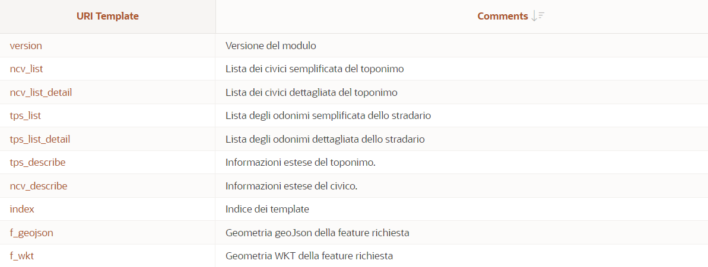

# openPa.sit.tpn REST Services
Servzi REST per il recupero dei dati toponomastici, in particolare i toponimi dello stradario e i civici resi disponibili dal 
Comune di Casalecchio di Reno attraverso un set di URI pubbliche e accessibili tramite richieste HTTP/S:GET.

Il modulo REST prevede template che restituiscono "array" di oggetti json e template che restituiscono oggetti json con dati di dettaglio per una entità.
I primi servono a recuperare le liste degli oggetti e relativi id i secondi servono a recuperare dati di dettaglio per una entità specifica utilizzando l'id ricavato dai primi.

Esistono template specificatamente dedicati alla toponomastica **tps_xxx**, ai civici **ncv_xxx** e servizi espressamente dedicati alle feature geometriche **f_geo_xxx** 

  
# Indice

- [Dipendenze](#Dipendenze)
- [Descrizione servizi](#Servizi-REST)
- [Esempi](#Esempi)
- [Specifiche tecniche](#Specifiche)
- [Licenza](#Licenza)

# Dipendenze
- Strutture dati memorizzate in DB Oracle.
- Ambiente Oracle REST Data Services (ORDS) configurato.
- DZ_JSON package usato per trsformare in oggetti geoJson gli oggetti SDO. Necessario solo nelle versioni oracle pre 19c

La configurazione operativa utilizza:
- Oracle Database 11g Enterprise Edition Release 11.2.0.4.0 - 64bit Production 
- ORDS Version 20.3.0.r3011819. _ORDS è deployato sotto tomcat_
 
# Servizi REST
~~~
Le URL per richiedere i servizi seguono la sintassi:
http://server.com/ords/sit/tpn/uri-template/[:id][?param=value&param=value.....]
|________________|____|________|_|_________|____| |____________________________|
           |        |     |     |     |      |                   |
           |        |     |     |     |       - Bind Variable    - coppie param=valore (metodi alternativi)
           |        |     |     |     | 
           |        |     |     |      - URI Template
           |        |     |     |
           |        |     |      - Module Base Path
           |        |     |
           |        |      - Schema Alias
           |        |      
           |         - ORDS Alias
           |               
            - Server URL  
			
la path fissa fino all template del servizio è  
		https://sportellounico.comune.casalecchio.bo.it/ords/casa/openpa/sit/tpn/

I servizi utilizzano il metodo HTTP:GET e tornano la response in josn		
 ~~~

| URI template?parameters | Descrizione |
| --- | --- |
| index | Iindice dei servizi aggiornato, con commenti. |
| tps_list?codcom=codicecatastaleconume | Lista sinteetica dei toponimi TPS gestita dal ente **codicecatastaleconume**. (a) |
| tps_list_detail?codcom=codicecatastaleconume | Lista dettagliata dei toponimi TPS. |
| tps_describe?uidn=idnum  | Dettaglio del singolo toponimo **idnum** |
| ncv_list?uidn=idnum | Lista sintetica dei civici afferenti il toponimo **idnum** |
| ncv_list_detail?uidn=idnum | Lista dettagliata dei civici afferenti il toponimo **idnum** |
| ncv_describe?uidn=idnum | Dettaglio del singolo civico **idnum** |
| f_geojson?uidn=idnum\[&class=codiceclassefeature\] | Geometria della feature in geojson. (b) |
| f_wkt?uidn=idnum\[&class=codiceclassefeature\] | Geometria della feature in wkt. (b) |

---

(a) Per il Comune di Casalecchio di Reno il codice comunale e b880  
(b) Parametro opzionale, valore della classe GeoUML della componente spaziale richiesta, se assente torna di default il percorso sintetico per una entità relativa al dominio TPS, la posizione del civico per i domini NCV.  
le classi attualmente pubblicate sono:
- 030101101 ROU_S Percorso analitico per la classe TPS
- 030101103 ROU_S Percorso sintetico per la classe TPS
- 03010201  POS   Posizione del civico per la classe NCV

# Esempi
 
### Ottenere la lista dei toponimi del comune
Chiamo il servizio rest  passando il parametro codcom valorizzato al codice belfiore del Comune.
HTTTP method:POST uri:https://sportellounico.comune.casalecchio.bo.it/ords/casa/openpa/sit/tpn/tps_list?codcom=b880
la response è un oggetto json che contiene la lista dei singoli toponimi, con gli uid che posso usare per avere dettagli, geometrie, elenco civici....

~~~ 
... frammento json dell array per una via...
{
"uuid": "0da057d1-84e9-488d-e053-980a10acdb2e",
"uidn": "18112512612025005584817680991306701614",
"cod_istat": "037011",
"cod_via": 13800,
"toponimo": "VIA DEI MILLE",
"dug": "VIA",
"denominazione": "DEI MILLE"
}
~~~
Usando il servizio di dettaglio https://sportellounico.comune.casalecchio.bo.it/ords/casa/openpa/sit/tpn/tps_list_detail?codcom=b880  
ottengo nel json anche le uri già formattate dei template per i dettagli e  per le geometrie geojson
~~~
{
"uuid": "0da057d1-84e9-488d-e053-980a10acdb2e",
"uidn": "18112512612025005584817680991306701614",
"cod_istat": "037011",
"cod_via": 13800,
"toponimo": "VIA DEI MILLE",
"dug": "VIA",
"denominazione": "DEI MILLE",
"status": 1,
"data_i": "0001-12-31T23:00:00Z",
"fkuid_atto_i": null,
"cod_frazione": null,
"lunghezza": 554,
"bbox": "[11.27924415,44.4806481,11.28326745,44.48228459]",
"links": [
{
"rel": "url_dettaglio",
"href": "http://sportellounico.comune.casalecchio.bo.it/ords/casa/openpa/sit/tpn/tps_describe?uidn=18112512612025005584817680991306701614"
},
{
"rel": "url_feature_geojson",
"href": "http://sportellounico.comune.casalecchio.bo.it/ords/casa/openpa/sit/tpn/f_geojson?uidn=18112512612025005584817680991306701614"
}
]
},
~~~
Per ottenere i civici afferenti ad una strada richiamo la uri del servizio REST dedicato, valorizzando il parametro uidn con il codice presente nell'elenco precedente:  
https://sportellounico.comune.casalecchio.bo.it/ords/casa/openpa/sit/tpn/ncv_list?uidn=18112512612025005584817680991306701614

Per ottenere le coordinate di una strada richiamo la  uri del servizio REST:
http://sportellounico.comune.casalecchio.bo.it/ords/casa/openpa/sit/tpn/f_geojson?uidn=18112512612025005584817680991306701614
in questo caso avendo usato il template f_geojson ottendo le coordinate della polilinea in formato geoJson della classe 030101103 (non ho valorizzato il parametro nella chiamata)
~~~
{"type":"Feature","bbox":[11.279244,44.480648,11.283267,44.482284],
"geometry":{"type":"MultiLineString",
"coordinates":[[[11.27985,44.480648],[11.280228,44.481381],[11.282794,44.480792],[11.283267,44.482284]],[[11.279244,44.481637],[11.280228,44.481381]]]},
"properties":{"UUID":18112512612025005584817680991306701614,"SRID":4326,
"GEO_UML_CLASS":030101103}} 
~~~
Valorizzando il parametro class=030101101 si otterrebbero le coordiante del percorso analitico.
~~~
{"type":"Feature","bbox":[11.279244,44.480648,11.283267,44.482284],
"geometry":{"type":"MultiLineString",
"coordinates":[[[11.27985,44.480648],[11.280228,44.481381],[11.280531,44.481307],[11.281309,44.481088],[11.281947,44.480942],[11.282423,44.480799],[11.282617,44.480756],[11.282705,44.480763],[11.282794,44.480792],[11.282839,44.480838],[11.282875,44.480916],[11.282912,44.481016],[11.283267,44.482284]],[[11.279244,44.481637],[11.280228,44.481381]]]},
"properties":{"UUID":18112512612025005584817680991306701614,"SRID":4326,
"GEO_UML_CLASS":030101101}} 
~~~
Per ottenere le stesse cose in formato wkt uso il template **f_wkt**.

Il template **f_geojson** puo essere facilmente utilizzato anche all'interno di codice js, ad esempio in pagine con _mappe leaflet o _openLayer_ per ottenere le coordinate di un toponimo da visualizzare.  
_Per questo motivo le coordinate restituite sono volutamnte in EPSG:4326_

Per i civici si possono usare i template specifici.
il servizio per le feature geometriche è sempre lo stesso in quanto passando uuid è garantita l'univocità della feature indipendendentemente dalla classe.

# Maintainer

* Luca Pomi - Comune di Casalechio di Reno.

# Specifiche
Nella cartella **spec** sono presenti json di esempio relativi ai vari template e un  foglio (in lavorazione) per dettagliare i json nei vari casi.

# Licenza 
[Creative Commons - Attribuzione 4.0 Internazionale (CC BY 4.0)](https://creativecommons.org/licenses/by/4.0/deed.it)

Questo repository contiene la documentazione per utilizzare i servizi rest.

I servizi REST sono un di cui di un progetto modulare molto più ampio (OPEN_PA) utilizzato per gestire vari sistemi dati dell'ente che usano DB ORACLE come storage nativo o sono riconducibili a una conessione oracle.  

Il codice delle  strutture dei DB, le applicazioni APEX e i servizi REST sono disponibili a richiesta.

## Autori e Copyright
2022 (c) Pomi luca. Comune di Casalecchio di Reno.

## Licenze software dei componenti di terze parti
Si rimanda ai componenti utilizzati nello stack
- ORACLE DB 11.r2
- oracle APEX
- oracle ORDS
- Tomcat
- Pacchetto DZ_JSON https://github.com/pauldzy/DZ_JSON
